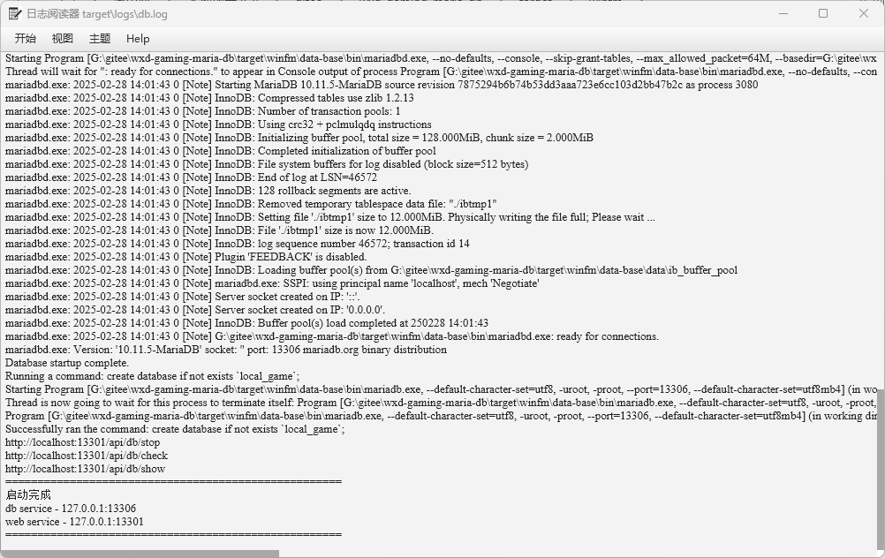

# wxd-gaming-mariadb

#### 介绍

基于mariadb 使用javafx 创建的数据库项目，
采用graalvm编译的windows数据库db，可以认为是绿色版mysql数据库

#### 软件架构

| 模块        | 说明                                        |
|-----------|-------------------------------------------|
| db-server | 模块基础模块，实现db和webserver功能                   |
| fx        | javafx项目，GUI界面化项目有系统托盘图标，界面托管system.out输出 |
| my.ini    | 数据库基础配置                                   |

#### 软件编译

打开 cmd 面板 通过 graalvm-win\package.bat 命令进行编译
编译完成后在 target\winfm\msql-server.exe 就是文件

#### 预览

